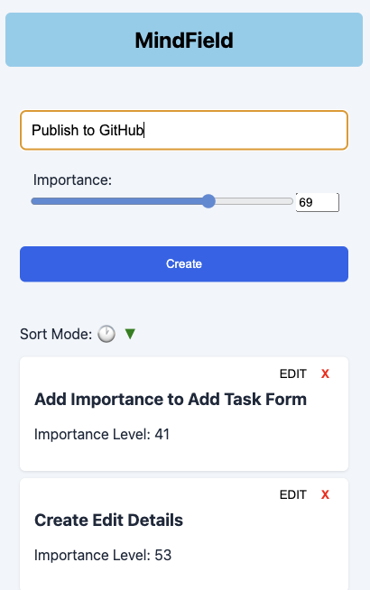

# Mind Field

Mind Field is a task management application built with React. It allows users to add, edit, delete, and sort tasks based on their importance levels.



## Setting Up

1. Clone the repository:
    ```sh
    git clone https://github.com/yourusername/mind-field.git
    ```
2. Navigate to the project directory:
    ```sh
    cd mind-field
    ```
3. Install the dependencies:
    ```sh
    npm install
    ```
4. Start the development server:
    ```sh
    npm start
    ```

## Features

- **Add Tasks**: Users can add new tasks with a specified importance level.
- **Edit Tasks**: Users can edit the name and importance level of existing tasks.
- **Delete Tasks**: Users can delete tasks from the list.
- **Sort Tasks**: Users can sort tasks by importance in ascending or descending order.
- **Persist Data**: Tasks are stored in local storage to persist data across sessions.